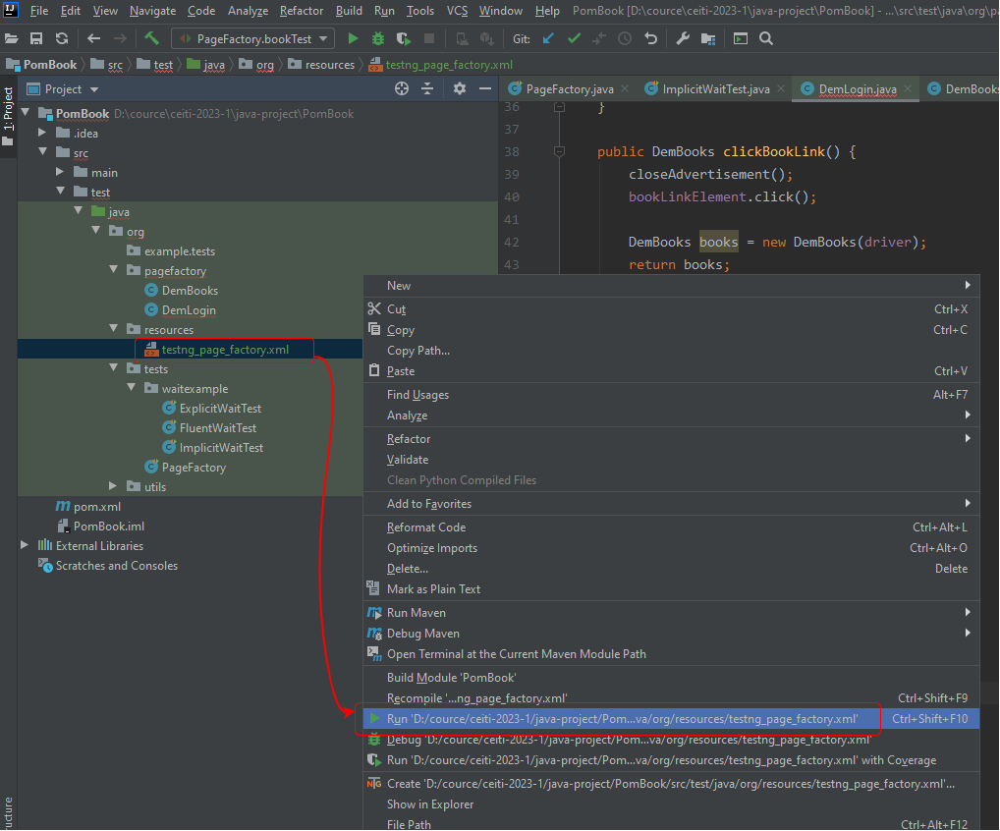

# Automated tests

## Installing git and clone project
   
Go to - https://git-scm.com/download/win and download git. 
Choose for windows one of those
* [64-bit Git for Windows Setup.](https://github.com/git-for-windows/git/releases/download/v2.42.0.windows.2/Git-2.42.0.2-64-bit.exe) 
* [32-bit Git for Windows Setup](https://github.com/git-for-windows/git/releases/download/v2.42.0.windows.2/Git-2.42.0.2-32-bit.exe)

To install `git`, run the downloaded file

Create a new folder for a new project, e.g. `cource` on D disk

- Open `PowerShell` as Administrator and run commands

```
cd D:\cource
git clone https://github.com/bbs-md/ceiti-2023-1.git
```

 `D:\cource\ceiti-2023-1` folder will appear

## Installing Required Software

  - Intelij IDEA - https://www.jetbrains.com/ru-ru/idea/download/#section=windows

  - Maven - https://maven.apache.org/download.cgi

  - JDK & JRE - https://www.oracle.com/java/technologies/downloads/

  - Chrome driver - https://chromedriver.chromium.org/downloads
  
  - Firefox - https://github.com/mozilla/geckodriver/releases
  
  - WebDriverManager - https://bonigarcia.dev/webdrivermanager/#driver-management

## Setting system environment variables in `Windows` OS

- Open `PowerShell` as Administrator and run commands

```
[Environment]::SetEnvironmentVariable("JAVA_HOME", "C:\Program Files\Java\jdk-14.0.2", "Machine")
[Environment]::SetEnvironmentVariable("MAVEN_HOME", "C:\Program Files\apache-maven-3.8.6", "Machine")
[Environment]::SetEnvironmentVariable("Path", $Env:Path + ';' + $Env:JAVA_HOME+  '\bin', "Machine")
[Environment]::SetEnvironmentVariable("Path", $Env:Path + ';' + $Env:MAVEN_HOME+  '\bin', "Machine")
```

- Check system variable. Open new `PowerShell` and run commands

```
echo $Env:JAVA_HOME
echo $Env:MAVEN_HOME
echo $Env:Path
```


## Environment versions (this is just an example)

 - java and maven
  


## Create new test user

We will use `https://demoqa.com` website for testing. Go to `https://demoqa.com` page and press `New user` button.

Fill in all fields and press `Register` button.

Use the `username` and `password` in tests `D:\cource\ceiti-2023-1\java-project\PomBook\src\test\java\org\tests\PageFactory.java`

## The task 

The task is to write automated tests for a resource `https://demoqa.com`

Test [login](https://demoqa.com/login) and [Book Store](https://demoqa.com/books) pages

To describe these pages there are classes in the `D:\cource\ceiti-2023-1\java-project\PomBook\src\test\java\org\pagefactory` folder: `DemLogin` and `DemBooks`.

Fill in the correct value of the locators in the @FindBy annotations and implement the methods in these classes so that the `D:\cource\ceiti-2023-1\java-project\PomBook\src\test\java\org\tests\PageFactory.java` tests pass

When implementing methods for checking and searching for elements on a page, use wait as in examples `D:\cource\ceiti-2023-1\java-project\PomBook\src\test\java\org\tests\waitexample\`

## Run test

Right click on file and run the test



## Expected test result

